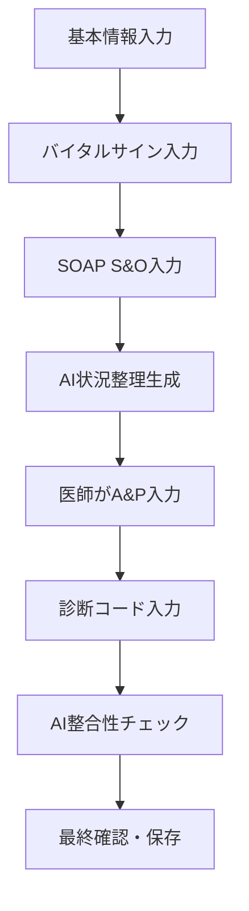

# Enhanced AI System Proposal - Azure OpenAI活用型電子カルテシステム

## 🎯 概要
現在の正規表現ベースのPII検知から、Azure OpenAIを活用した高度な医療AIシステムへの拡張提案

---

## 🔄 システム改善提案

### 1. PII検知・マスキングの高度化

#### **現在の実装**
- 正規表現ベースの固定パターン検知
- 日本語の医療用語に特化した簡易マスキング

#### **提案する改善**
```python
# Azure OpenAI APIを使用したPII検知
async def detect_pii_with_ai(text: str) -> List[PIIDetection]:
    """
    Azure OpenAI APIを使ってより高精度なPII検知
    - 文脈を理解した個人情報の特定
    - 医療用語と個人情報の適切な区別
    - 複雑な表現パターンの認識
    """
```

**メリット:**
- 文脈理解による誤検知減少
- 新しいパターンへの自動対応
- 医療専門用語との適切な区別

---

### 2. セーフティチェック機能の再設計

#### **現在の実装**
- 完成した文書に対する事後チェック
- ハルシネーション検知が主目的

#### **提案する新しいワークフロー**



#### **新機能1: リアルタイム状況整理**
```javascript
// 診療記録作成画面での実装
const generatePatientSummary = async (basicInfo, vitals, subjective, objective) => {
  const prompt = `
  以下の患者情報から、現在の状況を医学的に整理してください：

  【基本情報】
  ${basicInfo}

  【バイタルサイン】
  ${vitals}

  【主観的所見(S)】
  ${subjective}

  【客観的所見(O)】
  ${objective}

  この情報から、患者の現在の状況を簡潔に要約し、
  考慮すべき鑑別診断を提示してください。
  `;
  
  return await azureOpenAI.generate(prompt);
};
```

#### **新機能2: A&P整合性チェック**
```python
async def validate_assessment_plan(patient_summary: str, assessment: str, plan: str, diagnosis_codes: List[str]) -> ValidationResult:
    """
    AI生成の状況整理と医師入力のA&Pの整合性をチェック
    
    Returns:
    - 整合性スコア
    - 不整合点の指摘
    - 改善提案
    """
```

---

### 3. 患者詳細画面の強化

#### **新機能: 過去診療録の包括的要約**

```javascript
// 患者詳細画面に追加するコンポーネント
const PatientHistorySummary = ({ patientId }) => {
  const [summary, setSummary] = useState(null);
  
  const generateComprehensiveSummary = async () => {
    // 過去の全診療録を取得
    const encounters = await fetchPatientEncounters(patientId);
    
    // Azure OpenAI APIで包括的要約生成
    const prompt = `
    この患者の過去の診療録から、以下の観点で包括的な要約を作成してください：

    1. 慢性疾患と継続治療
    2. 重要な既往歴
    3. アレルギー・薬剤禁忌
    4. 最近の検査所見の推移
    5. 現在の治療方針
    6. 今後の注意点

    診療録データ:
    ${JSON.stringify(encounters)}
    `;
    
    const summaryResult = await azureOpenAI.generate(prompt);
    setSummary(summaryResult);
  };

  return (
    <div className="patient-history-summary">
      <button onClick={generateComprehensiveSummary}>
        📋 過去診療録を要約生成
      </button>
      {summary && <div className="summary-content">{summary}</div>}
    </div>
  );
};
```

#### **新機能: 紹介用マスキング機能**

```javascript
const ReferralSummaryGenerator = ({ patientId, comprehensiveSummary }) => {
  const generateReferralSummary = async (maskingLevel) => {
    const prompt = `
    以下の患者要約から、他院紹介用の退院サマリーを作成してください。

    【マスキングレベル】: ${maskingLevel}
    - minimal: 患者名のみマスキング
    - standard: 個人特定情報をマスキング
    - maximum: 最小限の医療情報のみ残す

    【患者要約】:
    ${comprehensiveSummary}

    【出力要件】:
    - FHIR準拠形式
    - 紹介先で必要な医療情報を過不足なく
    - プライバシー保護を考慮
    `;
    
    return await azureOpenAI.generate(prompt);
  };

  return (
    <div className="referral-summary-generator">
      <h3>🏥 紹介用サマリー生成</h3>
      <button onClick={() => generateReferralSummary('minimal')}>
        軽度マスキング
      </button>
      <button onClick={() => generateReferralSummary('standard')}>
        標準マスキング
      </button>
      <button onClick={() => generateReferralSummary('maximum')}>
        最大マスキング
      </button>
    </div>
  );
};
```

---

## 🏗️ 実装アーキテクチャ

### **Phase 1: PII検知の高度化**
```python
# app/services/enhanced_pii_service.py
class EnhancedPIIService:
    async def detect_pii_with_context(self, text: str, medical_context: bool = True):
        """Azure OpenAI APIを使用した文脈理解PII検知"""
        
    async def smart_masking(self, text: str, masking_level: str):
        """目的に応じた適応的マスキング"""
```

### **Phase 2: リアルタイム診療支援**
```python
# app/services/clinical_assistant_service.py
class ClinicalAssistantService:
    async def generate_patient_summary(self, clinical_data: Dict):
        """S&Oから患者状況の自動要約"""
        
    async def validate_clinical_reasoning(self, summary: str, assessment: str, plan: str):
        """A&Pの医学的妥当性チェック"""
```

### **Phase 3: 長期ケア管理**
```python
# app/services/longitudinal_care_service.py
class LongitudinalCareService:
    async def generate_comprehensive_summary(self, patient_id: int):
        """患者の包括的医療歴要約"""
        
    async def generate_referral_summary(self, patient_summary: str, destination: str):
        """紹介先に応じた適応的サマリー生成"""
```

---

## 🎯 期待される効果

### **医療の質向上**
- リアルタイムでの診断支援
- 見落としリスクの減少
- 継続性のある医療提供

### **効率性向上**
- 文書作成時間の短縮
- 過去履歴の迅速な把握
- 紹介手続きの簡素化

### **安全性強化**
- 文脈を理解したPII保護
- 医学的妥当性の自動チェック
- 適応的プライバシー制御

### **相互運用性**
- FHIR準拠の標準化
- 施設間連携の促進
- データの二次利用可能性

---

## 🚀 実装ロードマップ

### **Short Term (1-2ヶ月)**
1. Azure OpenAI PII検知の実装
2. リアルタイム状況整理機能の開発
3. A&P整合性チェック機能の追加

### **Medium Term (3-4ヶ月)**
1. 患者履歴包括要約機能
2. 紹介用マスキング機能
3. フロントエンド統合

### **Long Term (5-6ヶ月)**
1. 学習機能の追加
2. 多施設連携対応
3. パフォーマンス最適化

---

## 💡 技術的考慮事項

### **Azure OpenAI API利用最適化**
- プロンプトエンジニアリングの精緻化
- コスト効率的なAPIコール
- レスポンス時間の最適化

### **セキュリティ・プライバシー**
- 医療データの適切な暗号化
- 監査ログの強化
- GDPR/個人情報保護法対応

### **スケーラビリティ**
- 大量データ処理への対応
- リアルタイム性能の確保
- 多重並行処理の最適化

---

この提案により、現在のシステムから大幅に進化した、真に実用的な医療AIシステムを構築できます。